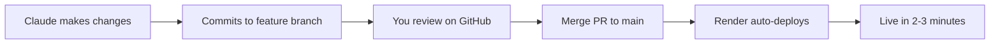

# Deploying Blocksmith to Render

This guide will walk you through deploying Blocksmith to Render, making it accessible online for anyone to use.

## Prerequisites

- GitHub account (with this repository)
- Render account (free at [render.com](https://render.com))
- API keys for at least one AI provider:
  - Anthropic API key (recommended - get from [console.anthropic.com](https://console.anthropic.com))
  - OpenAI API key (optional - get from [platform.openai.com](https://platform.openai.com))
  - Google AI API key (optional - get from [makersuite.google.com](https://makersuite.google.com))

## Deployment Steps

### 1. Push to Main Branch

First, merge your current feature branch to `main`:

```bash
# On GitHub, create and merge a Pull Request from:
# claude/update-config-file-01JcbrnPU1ETExex9HXD4rTe → main

# Or via command line:
git checkout main
git pull origin main
git merge claude/update-config-file-01JcbrnPU1ETExex9HXD4rTe
git push origin main
```

### 2. Connect Render to GitHub

1. Go to [render.com](https://render.com) and sign up/log in
2. Click **"New +"** → **"Web Service"**
3. Click **"Connect GitHub"** and authorize Render
4. Find and select your **Blocksmith** repository

### 3. Configure the Web Service

Render will auto-detect the `render.yaml` file. You can either:

**Option A: Use Blueprint (Recommended)**
- Render will show "Blueprint Detected"
- Click **"Apply Blueprint"**
- Skip to Step 4 (Environment Variables)

**Option B: Manual Configuration**
If the blueprint doesn't work:
- **Name**: `blocksmith` (or your choice)
- **Runtime**: `Python 3`
- **Branch**: `main`
- **Build Command**: `pip install -r requirements.txt`
- **Start Command**: `gunicorn app:app --bind 0.0.0.0:$PORT --workers 2 --timeout 120`
- **Plan**: Choose `Starter ($7/month)` or `Free` (spins down after inactivity)

### 4. Add Environment Variables

In the Render dashboard, add these environment variables:

| Key | Value | Notes |
|-----|-------|-------|
| `ANTHROPIC_API_KEY` | `sk-ant-...` | Your Anthropic API key (required) |
| `OPENAI_API_KEY` | `sk-...` | Your OpenAI API key (optional) |
| `GEMINI_API_KEY` | `AI...` | Your Google AI API key (optional) |
| `FLASK_ENV` | `production` | Enables production mode |
| `FLASK_SECRET_KEY` | *auto-generated* | Leave as auto-generated |

**How to add:**
1. Scroll down to **"Environment Variables"**
2. Click **"Add Environment Variable"**
3. Enter key and value
4. Click **"Save"**

### 5. Deploy

1. Click **"Create Web Service"** (or "Deploy")
2. Wait 3-5 minutes for the build to complete
3. You'll see the build logs in real-time

### 6. Access Your App

Once deployed, Render will provide a URL like:
```
https://blocksmith.onrender.com
```

Visit this URL to use Blocksmith online! 🎉

## Post-Deployment

### Continuous Deployment

Now that Render is connected to your `main` branch:

1. **When Claude makes changes**:
   - Changes are committed to feature branch
   - You review the changes
   - Merge PR to `main` on GitHub
   - Render auto-deploys within 2-3 minutes ✅

2. **Check deployment status**:
   - Visit Render dashboard
   - See recent deploys and logs

### Custom Domain (Optional)

To use your own domain (e.g., `blocksmith.yourdomain.com`):

1. In Render dashboard → **Settings** → **Custom Domain**
2. Add your domain
3. Update DNS records as instructed by Render

### Monitoring

- **Logs**: Render dashboard → **Logs** tab
- **Metrics**: Monitor request count, response times
- **Alerts**: Set up email alerts for errors

## Pricing

| Plan | Cost | Features |
|------|------|----------|
| **Free** | $0/month | 750 hours/month, spins down after 15min inactivity, slower builds |
| **Starter** | $7/month | Always on, faster builds, no spin-down |
| **Standard** | $25/month | More resources, better performance |

**Recommendation**: Start with **Starter** ($7/month) for a public-facing app that's always available.

## Troubleshooting

### Build Fails
- Check **Logs** in Render dashboard
- Ensure `requirements.txt` has all dependencies
- Verify Python version (Render uses Python 3.11 by default)

### App Won't Start
- Check **Logs** for errors
- Verify environment variables are set
- Check that `ANTHROPIC_API_KEY` is valid

### Slow Response Times
- Upgrade to **Starter** plan (Free tier spins down)
- Increase workers in `render.yaml` (change `--workers 2` to `--workers 4`)

### AI Generation Fails
- Verify API keys are correct
- Check API key has sufficient credits
- Check Render logs for specific error messages

## Support

- **Render Documentation**: [render.com/docs](https://render.com/docs)
- **Render Community**: [community.render.com](https://community.render.com)
- **Blocksmith Issues**: Open an issue on GitHub

## Update Workflow



Happy deploying! 🚀
